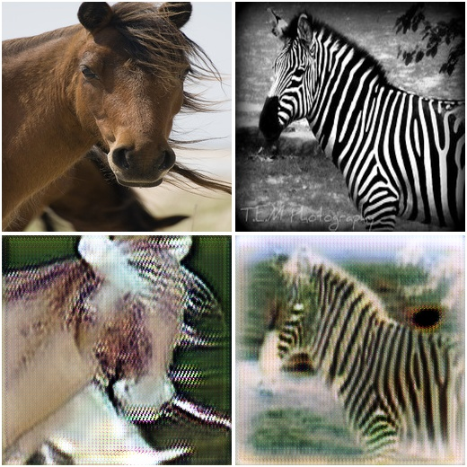
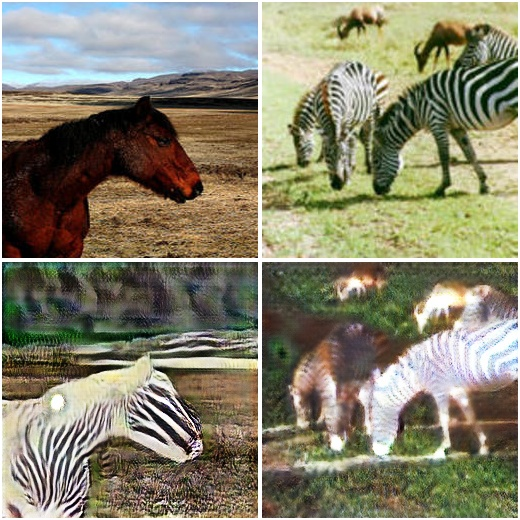

# CycleGAN

This is a swift for tensorflow implementation of Cycle-Consistent Adversarial Networks (CycleGAN)


# Original Paper

[here](https://arxiv.org/pdf/1703.10593.pdf)

# HowTo

The code will download the horse2zebra dataset automatically.

```
swift run 
```

# Results

# After 1000 steps


# After 10000 steps


# After 20000 steps


#  Reference

[1] https://github.com/dragen1860/TensorFlow-2.x-Tutorials/tree/master/15-CycleGAN
